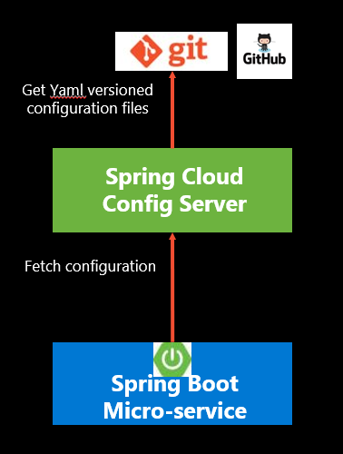

# aks-spring-withconfig-map
Spring Boot App deployed to AKS using a ConfigMap instead of the Spring-Config-Server


Read :
- [https://kubernetes.io/docs/concepts/configuration/configmap/#using-configmaps-as-files-from-a-pod](https://kubernetes.io/docs/concepts/configuration/configmap/#using-configmaps-as-files-from-a-pod)
- [https://kubernetes.io/docs/tasks/configure-pod-container/configure-pod-configmap/#populate-a-volume-with-data-stored-in-a-configmap](https://kubernetes.io/docs/tasks/configure-pod-container/configure-pod-configmap/#populate-a-volume-with-data-stored-in-a-configmap)
- [https://joshgunh.medium.com/spring-cloud-config-vs-kubernetes-configmap-detailed-comparison-bce64b594af8](https://joshgunh.medium.com/spring-cloud-config-vs-kubernetes-configmap-detailed-comparison-bce64b594af8)
- [https://developers.redhat.com/blog/2017/10/03/configuring-spring-boot-kubernetes-configmap#setup](https://developers.redhat.com/blog/2017/10/03/configuring-spring-boot-kubernetes-configmap#setup)
- [https://medium.com/@safvan.kothawala/change-log-level-in-all-kubernetes-pods-in-one-go-without-pod-restart-d7558f450dc0](https://medium.com/@safvan.kothawala/change-log-level-in-all-kubernetes-pods-in-one-go-without-pod-restart-d7558f450dc0)
- [https://sematext.com/blog/java-logging-frameworks/](https://sematext.com/blog/java-logging-frameworks/)
- [https://gap.gjensidige.io/docs/guides/preparing-spring-boot-app-for-kubernetes](https://gap.gjensidige.io/docs/guides/preparing-spring-boot-app-for-kubernetes)
- [https://docs.spring.io/spring-boot/docs/3.0.4/reference/html/howto.html#howto.logging.logback](https://docs.spring.io/spring-boot/docs/3.0.4/reference/html/howto.html#howto.logging.logback)
- [https://docs.spring.io/spring-boot/docs/3.0.4/reference/html/howto.html#howto.logging.log4j](https://docs.spring.io/spring-boot/docs/3.0.4/reference/html/howto.html#howto.logging.log4j)
- [https://www.baeldung.com/spring-boot-logback-log4j2](https://www.baeldung.com/spring-boot-logback-log4j2)



```bash
LOCATION="francecentral"
RG_APP="rg-hello-aks-cm"

az login

az group create --name $RG_APP --location $LOCATION

SUBSCRIPTION_ID=$(az account show --query id -o tsv | tr -d '\r')
TENANT_ID=$(az account show --query tenantId -o tsv | tr -d '\r')
USR_ID=$(az account show --query user.name -o tsv | tr -d '\r')
USR_SPN_ID=$(az ad user show --id ${USR_ID} --query id -o tsv | tr -d '\r')

az feature list --output table --namespace Microsoft.ContainerService
az feature register --namespace "Microsoft.ContainerService" --name "AKS-GitOps"
az feature register --namespace "Microsoft.ContainerService" --name "EnableWorkloadIdentityPreview"
az feature register --namespace "Microsoft.ContainerService" --name "AKS-Dapr"
az feature register --namespace "Microsoft.ContainerService" --name "EnableAzureKeyvaultSecretsProvider"
az feature register --namespace "Microsoft.ContainerService" --name "AKS-AzureDefender"
az feature register --namespace "Microsoft.ContainerService" --name "AKS-PrometheusAddonPreview" 
az feature register --namespace "Microsoft.ContainerService" --name "AutoUpgradePreview"
az feature register --namespace "Microsoft.ContainerService" --name "AKS-OMSAppMonitoring"
az feature register --namespace "Microsoft.ContainerService" --name "ManagedCluster"
az feature register --namespace "Microsoft.ContainerService" --name "AKS-AzurePolicyAutoApprove"
az feature register --namespace "Microsoft.ContainerService" --name "FleetResourcePreview"

az provider list --output table
az provider list --query "[?registrationState=='Registered']" --output table
az provider list --query "[?namespace=='Microsoft.KeyVault']" --output table
az provider list --query "[?namespace=='Microsoft.OperationsManagement']" --output table

az provider register --namespace Microsoft.KeyVault
az provider register --namespace Microsoft.ContainerRegistry
az provider register --namespace Microsoft.ContainerService
az provider register --namespace Microsoft.OperationalInsights 
az provider register --namespace Microsoft.DBforMySQL
az provider register --namespace Microsoft.DBforPostgreSQL
az provider register --namespace Microsoft.Compute 
az provider register --namespace Microsoft.AppConfiguration       
az provider register --namespace Microsoft.AppPlatform
az provider register --namespace Microsoft.EventHub  
az provider register --namespace Microsoft.Kubernetes 
az provider register --namespace Microsoft.KubernetesConfiguration
az provider register --namespace Microsoft.Kusto  
az provider register --namespace Microsoft.ManagedIdentity
az provider register --namespace Microsoft.Monitor
az provider register --namespace Microsoft.OperationsManagement
az provider register --namespace Microsoft.Network  

az provider register --namespace Microsoft.ServiceBus
az provider register --namespace Microsoft.Storage
az provider register --namespace Microsoft.Subscription

# https://learn.microsoft.com/en-us/azure/aks/cluster-extensions
az extension add --name k8s-extension
az extension update --name k8s-extension

# https://learn.microsoft.com/en-us/azure/azure-arc/kubernetes/tutorial-use-gitops-flux2?
az extension add -n k8s-configuration

export ssh_key=aksadm
echo -e 'y' | ssh-keygen -t rsa -b 4096 -f ~/.ssh/$ssh_key -C "youremail@groland.grd"

sshPublicKey=`cat /home/pinpin/.ssh/$ssh_key.pub`
az deployment group create --name hello-spring -f ./iac/bicep/main.bicep -g rg-hello-aks-cm  \
-p appName=hello42 -p location=francecentral \
-p sshPublicKey="$sshPublicKey" # https://learn.microsoft.com/en-us/azure/azure-resource-manager/bicep/deploy-cli#inline-parameters 

export REGISTRY_URL=$(az deployment group show --name acr -g $RG_APP --query properties.outputs.acrRegistryUrl.value -o tsv | tr -d '\r')
echo "REGISTRY_URL="$REGISTRY_URL

export CONTAINER_REGISTRY=$(az deployment group show --name acr -g $RG_APP --query properties.outputs.acrName.value -o tsv | tr -d '\r')
echo "CONTAINER_REGISTRY="$CONTAINER_REGISTRY

export ACR_ID=$(az deployment group show --name acr -g $RG_APP --query properties.outputs.acrId.value -o tsv  | tr -d '\r')
echo "ACR_ID="$ACR_ID

export AKS_CLUSTER_NAME=$(az deployment group show --name aks -g $RG_APP --query properties.outputs.aksClusterName.value -o tsv | tr -d '\r')
echo "AKS_CLUSTER_NAME="$AKS_CLUSTER_NAME

export managed_rg=$(az deployment group show --name aks -g $RG_APP --query properties.outputs.aksNodeResourceGroup.value -o tsv | tr -d '\r')
echo "managed_rg="$managed_rg

az aks get-credentials --name $AKS_CLUSTER_NAME -g $RG_APP
kubectl  cluster-info

acr_pull_role="/subscriptions/$SUBSCRIPTION_ID/providers/Microsoft.Authorization/roleDefinitions/7f951dda-4ed3-4680-a7ca-43fe172d538d"
az role assignment create --assignee $USR_SPN_ID --role $acr_pull_role --scope $ACR_ID

acr_push_role="/subscriptions/$SUBSCRIPTION_ID/providers/Microsoft.Authorization/roleDefinitions/8311e382-0749-4cb8-b61a-304f252e45ec"
az role assignment create --assignee $USR_SPN_ID --role $acr_push_role --scope $ACR_ID


mvn -B clean package --file pom.xml -DskipTests 
java -Dlogging.config=./cnf/log4j2.xml -jar target/hellospring-0.0.1-SNAPSHOT.jar
mvn dependency:tree

# image: ${CONTAINER_REGISTRY}.azurecr.io/${REPO}/hello-service:${IMAGE_TAG}
DOCKERFILE_PATH="src/main/docker/Dockerfile"
export REPOSITORY="hello"

# https://learn.microsoft.com/en-us/azure/container-registry/container-registry-get-started-docker-cli?tabs=azure-cli
# tag_id=$(docker build --build-arg --no-cache -t "test-v0.0.1" . 2>/dev/null | awk '/Successfully built/{print $NF}')

tag_id=$(DOCKER_BUILDKIT=0 docker build --build-arg --no-cache -t hello-service -f $DOCKERFILE_PATH . 2> /dev/null | awk '/Successfully built/{print $NF}')

# https://learn.microsoft.com/en-us/azure/container-registry/container-registry-authentication?tabs=azure-cli#individual-login-with-azure-ad
az acr login --name $CONTAINER_REGISTRY
TOKEN=$(az acr login --name $CONTAINER_REGISTRY --expose-token -o tsv --query accessToken | tr -d '\r')
docker login $REGISTRY_URL -u 00000000-0000-0000-0000-000000000000 --password $TOKEN
# az configure --defaults acr=${{ env.AZURE_CONTAINER_REGISTRY }}


docker tag hello-service $REGISTRY_URL/$REPOSITORY/hello-service:$tag_id
docker tag hello-service $REGISTRY_URL/$REPOSITORY/hello-service:latest

docker push "$REGISTRY_URL/$REPOSITORY/hello-service:latest"
docker push "$REGISTRY_URL/$REPOSITORY/hello-service:$tag_id"

GIT_CFG_URL=https://raw.githubusercontent.com/ezYakaEagle442/aks-cfg-srv/main

CONFIG_MAP_DIR=k8s/deploy/configmap
mkdir $CONFIG_MAP_DIR
ls -al $CONFIG_MAP_DIR

wget $GIT_CFG_URL/api-gateway.yml -O $CONFIG_MAP_DIR/api-gateway.yml
wget $GIT_CFG_URL/application-mysql.yml -O $CONFIG_MAP_DIR/application-mysql.yml
wget $GIT_CFG_URL/application.yml -O $CONFIG_MAP_DIR/application.yml
wget $GIT_CFG_URL/customers-service.yml -O $CONFIG_MAP_DIR/customers-service.yml
wget $GIT_CFG_URL/vets-service.yml -O $CONFIG_MAP_DIR/vets-service.yml
wget $GIT_CFG_URL/visits-service.yml -O $CONFIG_MAP_DIR/visits-service.yml

cp ./cnf/log4j2.yaml $CONFIG_MAP_DIR/log4j2.yaml
cp ./cnf/log4j2.xml $CONFIG_MAP_DIR/log4j2.xml
echo "About to generate the ConfigMap Manifest ..."

# You can use kubectl create configmap to create a ConfigMap from multiple files in the same directory. 
# When you are creating a ConfigMap based on a directory, kubectl identifies files whose filename is a valid key in the directory
# and packages each of those files into the new ConfigMap

kubectl create configmap spring-app-config --from-file=$CONFIG_MAP_DIR --dry-run=client -o yaml > k8s/spring-app-config.yaml
# immutable: true ==> https://kubernetes.io/docs/concepts/configuration/configmap/#configmap-immutable

ls -al $CONFIG_MAP_DIR
kubectl apply -f k8s/spring-app-config.yaml

mkdir k8s/deploy
export IMAGE_TAG=$tag_id

envsubst < k8s/hello-deployment.yaml > k8s/deploy/hello-deployment.yaml
envsubst < k8s/hello-ingress.yaml > k8s/deploy/hello-ingress.yaml 
envsubst < k8s/hello-service.yaml > k8s/deploy/hello-service.yaml 

kubectl apply -f k8s/deploy/hello-deployment.yaml
kubectl apply -f k8s/deploy/hello-ingress.yaml
kubectl apply -f k8s/deploy/hello-service.yaml

# kubectl  run -it hello-test --labels=app=hello-service --image="$REGISTRY_URL/$REPOSITORY/hello-service:$tag_id" -- /bin/bash
#  k exec -it  hello-service-74c6c76ff-4fq9j -- /bin/bash

az extension add --name aks-preview
az extension update --name aks-preview
az feature register --namespace "Microsoft.ContainerService" --name "EnableImageCleanerPreview"
az feature show --namespace "Microsoft.ContainerService" --name "EnableImageCleanerPreview"
az provider register --namespace Microsoft.ContainerService
az provider list --query "[?registrationState=='Registered']" --output table
az aks update -g $RG_APP -n $AKS_CLUSTER_NAME --enable-image-cleaner
kubectl apply -f ./k8s/delete-images.yaml

# Standard load Balancer Use Case
# Use the command below to retrieve the External-IP of the Service. Make sure to allow a couple of minutes for the Azure Load Balancer to assign a public IP.
service_ip=$(kubectl get service hello-service -n default -o jsonpath="{.status.loadBalancer.ingress[*].ip}")
public_ip_id=$(az network public-ip list -g $managed_rg --query "[?ipAddress!=null]|[?contains(ipAddress, '$service_ip')].[id]" --output tsv)
echo $public_ip_id

AZURE_DNS_LABEL_NAME=hello42
DNZ_ZONE="$AZURE_DNS_LABEL_NAME.$LOCATION.cloudapp.azure.com"
az network public-ip update --ids $public_ip_id --dns-name $AZURE_DNS_LABEL_NAME -g $managed_rg

# All config properties ref: sur https://docs.spring.io/spring-boot/docs/current/reference/html/common-application-properties.html 
echo "Your service is now exposed through a Load Balancer at http://${service_ip}"
echo "Your service is now exposed through a Load Balancer at http://${DNZ_ZONE}"

echo "Check Live Probe with Spring Actuator : http://${service_ip}/manage/health"
curl "http://${service_ip}/manage/health" -i -X GET
echo "\n"
# You should received an UP reply :
# {
#  "status" : "UP"
# }
echo "Check spring Management Info at http://${service_ip}/manage/info" -i -X GET
curl "http://${service_ip}/manage/info" -i -X GET


```


The default username is: user and the default password will be printed in the console at the time when your Spring Boot project starts :

```console
Using generated security password: befd946e-4242-4242-4242-989ebcd52c97

This generated password is for development use only. Your security configuration must be updated before running your application in production.
```

# GitOps

read the [docs](https://learn.microsoft.com/en-us/azure/azure-arc/kubernetes/conceptual-gitops-flux2?toc=https%3A%2F%2Flearn.microsoft.com%2Fen-us%2Fazure%2Faks%2Ftoc.json&bc=https%3A%2F%2Flearn.microsoft.com%2Fen-us%2Fazure%2Fbread%2Ftoc.json)

pre-req: enable GitOps add-on from the Azure portal

```sh
az k8s-extension create --extensionType=microsoft.flux --cluster-name $AKS_CLUSTER_NAME  -g $RG_APP --cluster-type managedClusters --scope cluster --release-train stable


```


# K8S Tips


```sh
  source <(kubectl completion bash) # setup autocomplete in bash into the current shell, bash-completion package should be installed first.
  echo "source <(kubectl completion bash)" >> ~/.bashrc 
  alias k=kubectl
  complete -F __start_kubectl k

  alias kn='kubectl config set-context --current --namespace '

  export gen="--dry-run=client -o yaml"

  alias kp="kubectl get pods -o wide"
  alias kd="kubectl get deployment -o wide"
  alias ks="kubectl get svc -o wide"
  alias kno="kubectl get nodes -o wide"

  alias kdp="kubectl describe pod"
  alias kdd="kubectl describe deployment"
  alias kds="kubectl describe service"

  vi ~/.vimrc
  set ts=2 sw=2
  . ~/.vimrc
``

